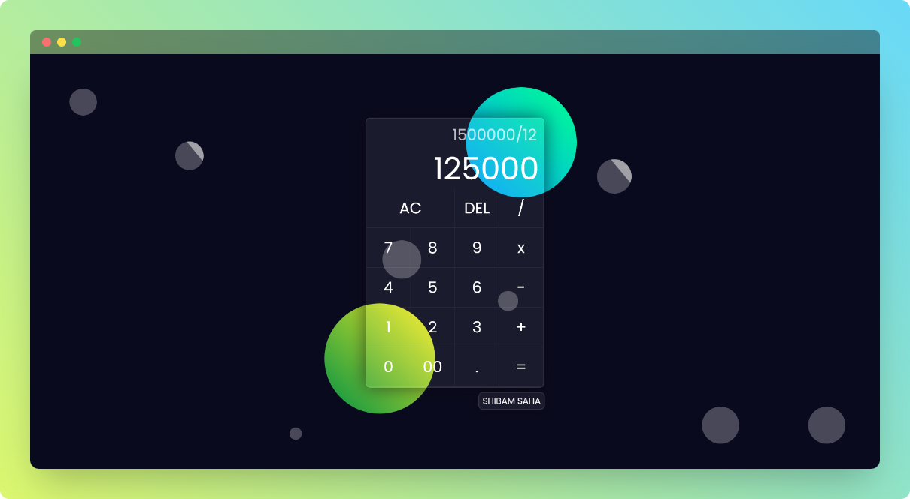

    

    <h1>Calculator</h1>
    
Calculator

    
    

 

## ⚡ Introduction

This is a simple responsive Calculator.  

## ✨ Features
  
- Basic binary operations
- Delete and All Clear support
- Glassmorphism Effect  

## ⚙️ Tech Stack
  
- HTML
- CSS
- JavaScript

## 🎯 Goal

- [x] To learn CSS animations
- [x] To apply JavaScript event listener and eval function

## 🖼️ Screenshot

## 👋🏻 Contact

