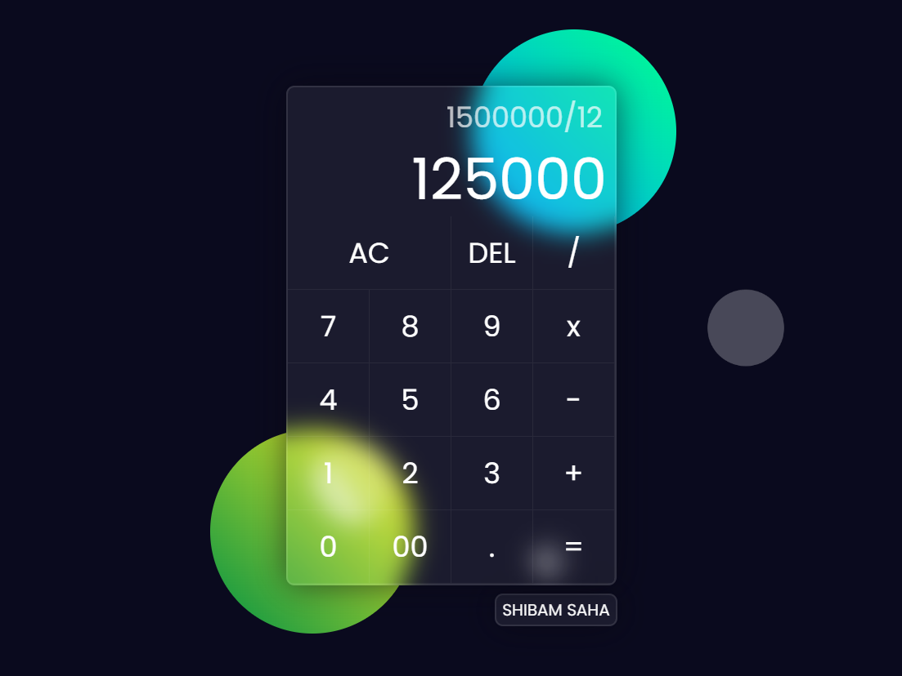

### Calculator - Glassmorphism Theme

**Details**

- This is a Calculator Web Application with all the basic features and functionalities like basic binary operations along with _Delete_ and _All Clear_ button.
- The design has been enhanced with a glossy (Glassmorphism effect), 3d looking color effect along with an background animation of moving monochrome bubbles.

**Tech Stack**

- This Calculator Web Application is made with HTML, CSS and Vanilla Javascript only.

**Live Link**

- [Calculator Web App](https://s4shibam-calculator.netlify.app)

**Reference Image**

 

**Follow Me**

